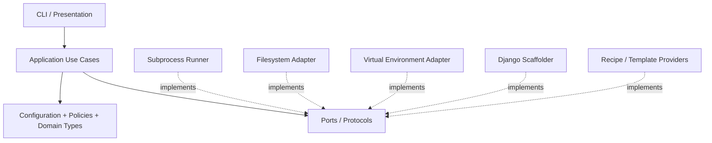

# Django-Start Development Rules

## 1. Engineering Objective

Django-Start is a deterministic, safe, extensible Django project scaffolding tool.

Every architectural or implementation decision MUST optimize for:

1. Safe project generation.
2. Predictable and reproducible output.
3. Compatibility with supported Python and Django versions.
4. Extensibility without modification of the core workflow.
5. Testability.
6. Cross-platform behavior.
7. Backward compatibility where it does not compromise correctness or security.

SOLID is a design constraint, not a requirement to maximize the number of classes.

---

## 2. Product Invariants

These rules are non-negotiable.

### 2.1 Never silently destroy user data

Django-Start MUST NOT overwrite an existing user-controlled file unless the operation was explicitly requested.

Existing projects, apps, settings, URLs, templates, dependency manifests, and configuration files MUST be treated as user data.

A conflict MUST produce a clear actionable error.

### 2.2 Generation must be deterministic

The same:

* Django-Start version
* recipe version
* Python version
* Django version
* command options

MUST produce equivalent project structure and configuration.

Unbounded commands such as:

```text
pip install django
```

are forbidden in project generation.

The exact selected Django version MUST be known before generation begins.

### 2.3 No hidden shell execution

`shell=True` is forbidden.

Commands MUST be passed as argument sequences.

Example:

```python
runner.run([
    python_executable,
    "-m",
    "pip",
    "install",
    f"Django=={django_version}",
])
```

Never:

```python
subprocess.run(
    f"{python} -m pip install Django=={version}",
    shell=True,
)
```

User-provided values MUST never be interpolated into shell commands.

### 2.4 No hidden network operations

Network operations MUST be explicit and attributable.

The tool MUST NOT:

* upgrade pip without being asked;
* update itself;
* download arbitrary templates silently;
* install an unspecified Django version.

### 2.5 A successful generation is a verified generation

Before reporting success, Django-Start MUST verify the generated project.

At minimum:

```text
python manage.py check
```

must succeed.

Generated Python files MUST compile successfully.

---

# 3. Supported Platforms

Django-Start 2.x supports:

* Python 3.12
* Python 3.13
* Python 3.14

Supported Django release lines:

* Django 5.2 LTS
* Django 6.1

The default is the latest tested patch release from the newest supported stable Django feature line.

Pre-release Python or Django versions MAY be exercised by non-blocking canary CI jobs, but MUST NOT become the default generator target.

Windows, Linux, and macOS are first-class supported platforms.

Platform-specific path or shell assumptions are forbidden.

---

# 4. Architecture Rules

Dependencies always point inward.



The CLI MUST NOT:

* manipulate files;
* execute subprocesses;
* install packages;
* know filesystem layout details.

Its responsibilities are limited to:

1. parse input;
2. create configuration;
3. invoke a use case;
4. present the result/error.

---

# 5. SOLID Rules

## Single Responsibility

A component MUST have one primary reason to change.

Separate:

* CLI parsing;
* version policy;
* environment creation;
* package installation;
* command execution;
* project scaffolding;
* recipes/templates;
* filesystem operations;
* project verification;
* console rendering.

A generic `Environment` object MUST NOT also act as a file editor.

## Open/Closed

Adding a new project style MUST NOT require editing the core generation workflow.

Examples:

```text
basic
api
postgres
docker
celery
production
```

must be implementable as recipes/providers.

## Liskov Substitution

Infrastructure implementations MUST honor their port contracts.

A fake command runner used in tests must be substitutable for the real subprocess runner without changing application behavior.

## Interface Segregation

Prefer focused protocols:

```text
CommandRunner
EnvironmentManager
PackageInstaller
ScaffoldEngine
ProjectVerifier
FileSystem
Recipe
```

instead of one large manager interface.

## Dependency Inversion

Application use cases depend on protocols, never on `subprocess`, Click, or operating-system details directly.

---

# 6. Composition Over Inheritance

Infrastructure capabilities MUST be composed.

Avoid:

```text
AppManager -> Environment
ProjectManager -> Environment
```

Prefer:

```text
CreateProjectUseCase
 ├── EnvironmentManager
 ├── PackageInstaller
 ├── ScaffoldEngine
 ├── Recipe
 └── ProjectVerifier
```

Inheritance is allowed only when there is a genuine substitutable "is-a" relationship.

---

# 7. Filesystem Rules

Use `pathlib.Path`.

Do not construct filesystem paths with string concatenation.

Project-relative template names MUST use portable POSIX-style identifiers such as:

```text
blog/index.html
```

not operating-system separators.

All text files MUST be read and written explicitly as UTF-8.

Generation should occur in a controlled staging area whenever practical.

A failed generation MUST:

* clean safely created temporary resources; or
* explicitly report what remains and why.

---

# 8. Django Generation Rules

Do not patch arbitrary Django-generated Python files using assumptions about exact whitespace or exact lines.

Forbidden patterns include:

```python
line_list.index("]\n")
```

as an architectural mechanism.

Prefer:

1. controlled Django project/app templates;
2. controlled recipe rendering;
3. structured generation owned by Django-Start.

Django's native `startproject` and `startapp` machinery should remain the underlying scaffolding primitive where appropriate.

Any remote template MUST be explicitly trusted by the caller and MUST NOT execute implicitly.

---

# 9. Command Execution Rules

All external execution goes through `CommandRunner`.

The runner MUST support:

* argument sequence;
* working directory;
* environment additions;
* captured stdout;
* captured stderr;
* exit code;
* timeout where appropriate.

Library/infrastructure code MUST NOT call `sys.exit()`.

It raises typed exceptions.

Only the CLI converts those exceptions to process exit codes.

---

# 10. Error Model

Create project-specific exceptions, for example:

```text
DjangoStartError
├── ConfigurationError
├── UnsupportedVersionError
├── ProjectConflictError
├── EnvironmentCreationError
├── DependencyInstallError
├── ScaffoldError
└── VerificationError
```

Errors presented to the user MUST contain:

* what failed;
* relevant command or operation;
* actionable recovery information.

Secrets and sensitive environment values MUST NOT appear in errors or logs.

---

# 11. Versioning Rules

Django-Start uses Semantic Versioning.

Package version has exactly one source of truth.

Runtime version lookup should use package metadata rather than a duplicated hard-coded constant.

Breaking CLI or generated-project changes require a major version.

Recommended revival line:

```text
2.0.0a1
→ 2.0.0b1
→ 2.0.0rc1
→ 2.0.0
```

The old:

```text
django-start PROJECT APP
```

may be retained temporarily as a compatibility adapter for:

```text
django-start new PROJECT --app APP
```

but deprecated behavior must be documented.

Self-updating the application through:

```text
django-version --update
```

must be removed.

Package managers own package upgrades.

---

# 12. Dependency Rules

Published runtime dependencies use compatible bounded ranges rather than unnecessarily exact patch pins.

Example:

```toml
dependencies = [
    "click>=8.5,<9",
]
```

Development tooling may be reproducibly locked.

Generated projects MUST explicitly record the Django release used to create them.

A generated project's dependency manifest MUST NOT be created by blindly freezing the generator environment.

Avoid:

```text
pip freeze > requirements.txt
```

as the project's dependency design strategy.

---

# 13. Python Coding Standards

All public application/core APIs MUST be typed.

Use modern Python syntax compatible with the minimum supported Python version.

Prefer:

* immutable dataclasses for configuration;
* enums/literals for finite choices;
* Protocols for ports;
* `pathlib.Path`;
* explicit imports;
* small pure functions where possible.

Forbidden:

* `from module import *`
* runtime `sys.path` mutation
* unused debug/test methods in production classes
* broad exception swallowing
* hidden mutable global state

Functions should communicate state through arguments and return values instead of process-wide environment mutation wherever possible.

---

# 14. Testing Rules

No refactor of existing observable behavior starts before characterization tests exist.

Test layers:

```text
Unit
  ↓
Integration
  ↓
Generated-project smoke tests
  ↓
Cross-platform compatibility
```

## Unit tests

Must cover:

* input validation;
* version policy;
* command construction;
* recipes;
* error translation;
* path behavior.

No real subprocesses or networks in unit tests.

## Integration tests

Must cover:

* virtual environment creation;
* Django installation;
* scaffolding;
* generated files.

## Generated project tests

Every supported representative configuration must pass:

```text
python manage.py check
```

and Python compilation.

Golden/snapshot assertions should verify important generated files.

## Regression tests

Every confirmed bug receives a regression test before or with its fix.

## Coverage

Coverage is a quality signal, not the target itself.

During revival, coverage MUST never decrease.

Target after the 2.0 migration:

```text
>= 90% project coverage
```

with critical application/domain code expected to be higher.

---

# 15. CI Rules

No pull request merges unless required checks pass.

Required checks:

```text
Ruff lint
Ruff format --check
mypy
pytest
coverage
package build
generated-project smoke test
CodeQL
```

Primary compatibility matrix:

```text
Python 3.12 × Django 5.2
Python 3.12 × Django 6.1
Python 3.13 × Django 5.2
Python 3.13 × Django 6.1
Python 3.14 × Django 5.2
Python 3.14 × Django 6.1
```

Cross-platform smoke coverage MUST include:

```text
Ubuntu
Windows
macOS
```

The complete Cartesian matrix does not need to run for every commit if CI cost becomes excessive.

Use a representative PR matrix and a broader scheduled/release matrix.

---

# 16. Security Rules

Security has priority over backward compatibility.

Mandatory:

* never `shell=True`;
* validate project/app names;
* reject path traversal;
* do not execute untrusted project templates;
* minimum GitHub Actions permissions;
* Dependabot for Python and GitHub Actions;
* CodeQL current supported major;
* no long-lived PyPI secret when Trusted Publishing is available.

Third-party GitHub Actions SHOULD be pinned to trusted immutable revisions in high-assurance workflows.

---

# 17. Packaging Rules

`pyproject.toml` is the canonical packaging configuration.

Do not duplicate metadata across:

```text
setup.py
setup.cfg
pyproject.toml
```

Use a `src/` layout.

Recommended structure:

```text
django-start/
├── pyproject.toml
├── README.md
├── LICENSE
├── src/
│   └── django_start/
│       ├── __init__.py
│       ├── cli.py
│       ├── config.py
│       ├── application/
│       ├── ports/
│       ├── infrastructure/
│       ├── recipes/
│       └── templates/
├── tests/
│   ├── unit/
│   ├── integration/
│   └── e2e/
└── docs/
```

The distribution may remain:

```text
django-start-automate
```

while the import package becomes:

```python
django_start
```

---

# 18. Git and Pull Request Rules

`main` must always be releasable.

Changes enter `main` through pull requests after CI.

Use Conventional Commits or an equivalently consistent format.

Examples:

```text
feat(cli): add Django version selector
fix(scaffold): prevent existing urls.py overwrite
refactor(core): introduce command runner port
test(generator): add Django 6.1 smoke project
docs(architecture): document recipe lifecycle
```

One PR should represent one coherent engineering concern.

Architecture-changing decisions require an ADR.

Generated behavior changes require:

* tests;
* documentation;
* migration/release note entry.

---

# 19. Documentation Rules

Documentation is part of the feature.

A feature is incomplete if its public behavior changes without documentation.

Repository documentation should contain:

```text
docs/
├── architecture.md
├── development-rules.md
├── modernization-plan.md
├── support-policy.md
├── contributing.md
└── adr/
```

README remains onboarding-focused and should not become the entire technical manual.

---

# 20. Definition of Done

A change is done only when:

* behavior is implemented;
* tests exist;
* typing passes;
* lint/format passes;
* generated-project verification passes when applicable;
* docs are updated;
* no known unsafe overwrite behavior exists;
* no new hidden network or shell side effect exists;
* CI passes on all required checks.

Correctness, safety, maintainability, and reproducibility take priority over minimizing lines of code.


## Legacy Characterization and Modernization Rules

These rules apply while establishing the Django Start 1.1.6 behavioral baseline and throughout the subsequent modernization work.

1. **Treat `djstartlib/` 1.1.6 as immutable during characterization.**
   Do not modify production behavior, refactor implementation code, rename APIs, fix bugs, modernize syntax, or change runtime semantics while establishing the baseline.

2. **Characterization and repair are separate phases.**
   The characterization phase answers:
   `What does version 1.1.6 actually do?`

   The repair/modernization phase answers:
   `What should Django Start do going forward?`

   Never mix these two concerns in the same change.

3. **A discovered bug is not permission to fix the bug.**
   When an existing defect is discovered:

   * reproduce it reliably;
   * document the inputs, environment, and observed behavior;
   * classify it as a known defect;
   * create a regression test or `xfail(strict=True)` reproducer when appropriate;
   * defer the implementation fix to a separate modernization task.

4. **Do not preserve accidental implementation details unnecessarily.**
   Characterize externally observable contracts first:
   CLI behavior, generated files, filesystem mutations, exit codes, stdout/stderr, configuration changes, public Python APIs, and error behavior.

   Avoid asserting private implementation details unless no stable external observation is possible.

5. **Distinguish three kinds of behavior explicitly.**
   Every important characterization should be understood as one of:

   * intended/public behavior;
   * legacy but relied-upon behavior;
   * known defective behavior.

   Do not silently promote a historical bug into a permanent product contract.

6. **Prefer black-box and boundary tests before deep mocks.**
   Test commands and public interfaces through realistic temporary filesystems and controlled environments wherever practical.
   Mock external boundaries only when necessary.
   Avoid tests coupled to internal call order or private functions.

7. **Characterization tests must be deterministic.**
   Tests must not depend on:

   * internet access;
   * developer-machine state;
   * current working directory unless explicitly under test;
   * current date/time;
   * random temporary paths appearing in expected output;
   * globally installed packages;
   * shell configuration.

8. **Capture the original execution environment before modernization.**
   Record the Python version, Django version, dependency versions, packaging configuration, supported commands, installation mechanism, and known platform assumptions required to reproduce 1.1.6.

9. **Do not perform dependency modernization during baseline establishment.**
   Add only the minimum tooling required to execute and track the characterization suite.
   Package upgrades belong to a later compatibility and modernization phase.

10. **Infrastructure changes must have zero intended product behavior impact.**
    Changes to `.gitignore`, pytest configuration, CI configuration, or test dependencies must not alter `djstartlib` runtime behavior.

11. **Make `.gitignore` changes narrowly.**
    Remove or replace the overbroad `*test*` rule without unintentionally tracking build artifacts, caches, virtual environments, coverage output, or generated files.

12. **Do not introduce unrelated repository modernization.**
    For example, do not migrate packaging from `setup.py` to `pyproject.toml` merely because pytest configuration is needed.
    Choose the least invasive test configuration compatible with the existing repository.

13. **Every test should protect a reasoned contract.**
    Before adding a characterization test, identify what future regression it is intended to detect.
    Avoid generating large numbers of shallow tests solely to increase coverage.

14. **Coverage is a discovery tool, not the objective.**
    Use coverage to locate unobserved behavior, but prioritize meaningful behavioral coverage over a target percentage.

15. **Characterize dangerous and irreversible operations safely.**
    Commands that create, delete, overwrite, install, or modify files must execute inside isolated temporary environments.
    Never allow characterization tests to mutate the developer's real environment.

16. **Generated project output is part of the product contract.**
    Characterize important generated directory structures, settings modifications, URL wiring, templates, applications, and command output.
    Prefer focused structural assertions over brittle full-directory snapshots unless a snapshot clearly provides greater protection.

17. **Preserve evidence before changing behavior later.**
    Any modernization change that intentionally changes characterized behavior must reference the affected characterization test and explicitly state why the behavior is being changed.

18. **One conceptual change per commit whenever practical.**
    Separate:
    test-infrastructure repair,
    baseline characterization,
    known-defect documentation,
    behavior fixes,
    refactoring,
    dependency upgrades,
    and architecture changes.

    This keeps historical reasoning and regression diagnosis possible.

19. **Repository instructions are authoritative.**
    Before asking the user a scope or architecture question, inspect `AGENTS.md`, existing documentation, ADRs, tests, git history, and task requirements.
    If those sources establish the answer unambiguously, proceed and state the assumption rather than asking a redundant question.

20. **When uncertain, protect historical evidence.**
    During the 1.1.6 baseline phase, prefer preserving and documenting existing behavior over modifying it.
    Modernization becomes safe only after the behavioral safety net exists.


## Repository Quality Gates and Agent Execution Discipline

These rules apply to every agent task, including documentation, tests, infrastructure, refactoring, maintenance, and feature development.

1. **Discover repository quality gates before editing files.**

   Before implementation begins, inspect all relevant repository-controlled validation configuration, including:

   * `AGENTS.md`
   * `.pre-commit-config.yaml`
   * CI workflows
   * `pyproject.toml`
   * `setup.cfg`
   * `tox.ini` / `noxfile.py` when present
   * test configuration
   * formatter, linter, type-checker, and build configuration

   Do not assume the project's quality commands from general ecosystem conventions.

2. **Run baseline validation before making changes.**

   Execute the relevant existing quality gates before implementation whenever practical.

   Record pre-existing failures separately from failures introduced by the task.

   A task must never silently take ownership of unrelated historical repository failures.

3. **Repository-controlled tooling is authoritative until explicitly migrated.**

   The tooling actually configured in the repository remains authoritative until a dedicated tooling migration changes it.

   Future-state architecture rules do not silently replace current repository tooling.

   For example, if the repository currently runs Black and Flake8 while the modernization target is Ruff, agents must respect the current checks until the Ruff migration is explicitly implemented.

4. **Every changed file must pass its applicable quality gates.**

   Before committing, run the configured formatter, linter, syntax checks, and relevant tests against files changed by the task.

   Newly introduced code must not add formatter, lint, type-checking, or test failures.

5. **Auto-fix tools do not grant permission to expand task scope.**

   Formatters, linters, pre-commit hooks, and code-modification tools may modify files automatically.

   After every auto-fix operation, inspect the resulting diff.

   If a tool modifies a frozen, protected, or unrelated file, do not automatically commit that modification.

   Revert out-of-scope changes unless the current task explicitly authorizes them.

6. **Frozen legacy code remains frozen even when a global formatter wants to modify it.**

   During a characterization or compatibility-baseline phase, formatter output is not permission to rewrite production code.

   Pre-existing style violations in frozen code must be reported and addressed in a separate cleanup or modernization change.

7. **Run pre-commit deliberately at two scopes.**

   During development, run hooks against task-owned changed files.

   Before final handoff, also run the repository-wide pre-commit validation when available.

   Repository-wide failures must be classified as either:

   * introduced by this task; or
   * pre-existing/out-of-scope repository debt.

   Failures introduced by the task must be fixed before handoff.

8. **Never claim CI-clean status when a required gate is known to fail.**

   A successful test suite does not mean the repository is fully verified.

   Completion reports must distinguish independently between:

   * tests;
   * lint;
   * formatting;
   * type checking;
   * build/package validation;
   * security checks;
   * generated-project checks;
   * CI status.

   If one required gate remains failing, report the task as functionally complete but not fully CI-green.

9. **Verification must use the declared environment.**

   If documentation declares a canonical Python, Django, operating-system, or dependency environment, final verification must run in that environment.

   Passing on a newer or different interpreter does not substitute for verification of the declared baseline.

10. **Verification environments must not depend on undeclared tooling.**

    Use a clean virtual environment for authoritative test runs.

    Install only declared runtime and test dependencies unless additional tools are explicitly documented.

    Unexpected globally installed or automatically loaded pytest plugins must not influence authoritative characterization results.

    When appropriate, disable pytest plugin auto-discovery for baseline verification.

11. **Re-run modified hooks until stable.**

    Any pre-commit hook that modifies files requires another validation pass.

    A formatting or lint run is complete only when a subsequent run produces no changes and exits successfully for the applicable scope.

12. **Inspect the final diff before every commit and handoff.**

    Verify that:

    * only intended files changed;
    * no protected file changed accidentally;
    * no generated/cache artifact was added;
    * no debug code remains;
    * no formatter-created unrelated changes remain;
    * no secrets or machine-specific paths were introduced.

13. **Separate repository hygiene from behavior changes.**

    Large formatting migrations, lint normalization, import cleanup, formatter replacement, and pre-commit modernization must be isolated from functional refactoring whenever practical.

    Behavior-preserving formatting changes should have their own commit or pull request so characterization tests can prove that observable behavior did not change.

14. **Public re-exports must not be deleted merely to satisfy unused-import rules.**

    `__init__.py` exports and compatibility imports may form part of the public API.

    Resolve lint warnings using explicit exports such as `__all__`, justified per-file configuration, or an intentional API migration.

    Do not delete an import until its compatibility impact has been determined.

15. **Authoritative documentation requires implementation evidence.**

    Statements describing current behavior must be supported by inspected implementation, a reproducing test, or both.

    Do not document inferred behavior as a reproduced fact.

    When evidence is incomplete, classify the statement as an observation, hypothesis, or known limitation instead.

16. **Completion claims must be evidence-based.**

    Words such as `verified`, `complete`, `fully passing`, `deterministic`, and `CI green` may only be used when the corresponding verification was actually executed successfully.

    Final agent reports must include the relevant environment and commands used to establish those claims.