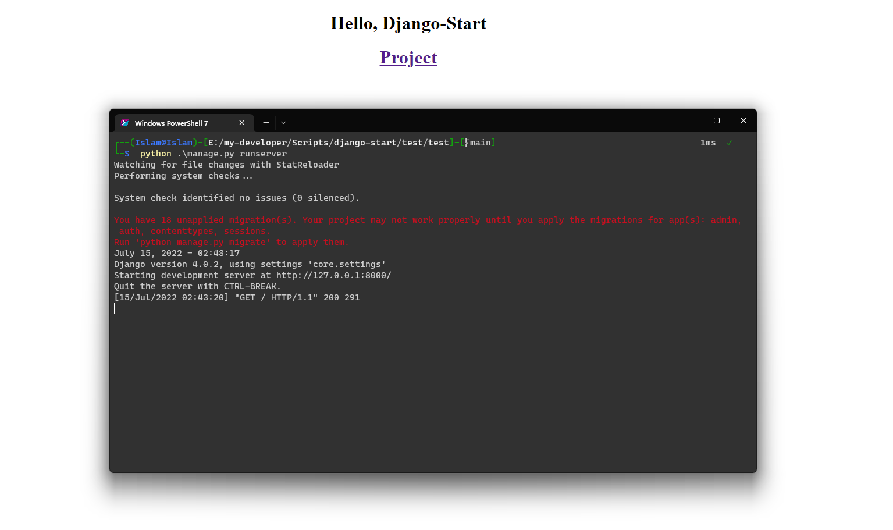

<h1 style="text-align: center">Django Start Automate Script ✨</h1>
<div style="text-align: center">

    Django automate start project and create app
    This script saves time for you to start a new Django project.
    It creates the project and creates the first app
    and then updates the project settings file and
    also updates the project urls file and then creates a views
    and configures the application urls file and
    also creates the index.html

</div>

<div style="text-align: center">


</div>

---
### open start manu and type Edit the system environment variables

- #### click Environment Variables

### click Path variables


### insert script install path

- #### click ok
---
## Success Install 🎊



## Welcome to contribute ❤

```shell
pip install pyinstaller | pyinstaller --noconfirm --onefile --console --add-data <requests_package_path> --add-data <djstartlib>  "django-start.py"
```
