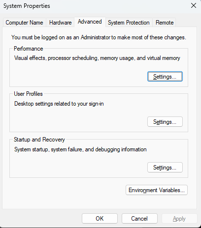
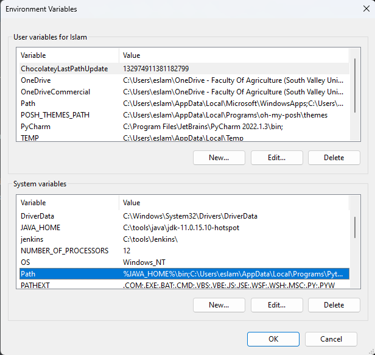
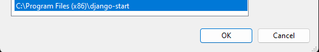
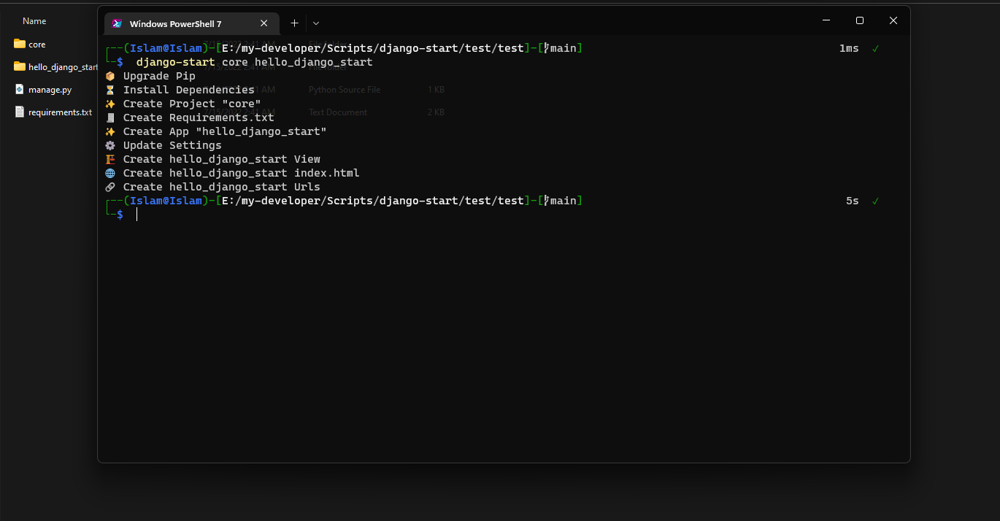

# Django Start Automate Script ✨
> Django automate start project and create app

This script saves time for you to start a new Django project.
It creates the project and creates the first app 
and then updates the project settings file and 
also updates the project urls file and then creates a views 
and configures the application urls file and 
also creates the index.html

---
### open start manu and type Edit the system environment variables

- #### click Environment Variables

### click Path variables

### insert script install path

- #### click ok
---
## Success Install 🎊

## Welcome to contribute ❤