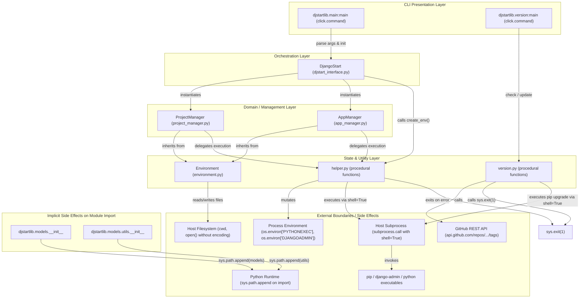

# Django-Start 1.1.6 Architecture & Technical Debt Audit

## 1. Executive Summary

This document reconstructs the complete implementation architecture of `django-start` 1.1.6, inspects its constituent components, traces coupling and side effects, details its accumulated technical debt, and establishes the Contract Migration Matrix.

The findings in this document are derived from direct analysis of:
- Production code in `djstartlib/`
- Packaging metadata in `setup.cfg`, `setup.py`, and `pyproject.toml`
- Baseline characterization suite (45 tests across 8 test modules) in `tests/`
- Legacy characterization baseline specification in `docs/baseline-1.1.6.md`

All factual statements regarding 1.1.6 behavior are verified by characterization tests.

---

## 2. 1.1.6 Architecture Map

The 1.1.6 runtime follows an inverted procedural pipeline with heavy inheritance and pervasive side effects.



---

## 3. Component Deep Dive & Responsibility Audit

### 3.1 CLI Entry Points (`djstartlib/main.py` and `djstartlib/version.py`)

#### `djstartlib/main.py`
- **Responsibility**: Parse arguments for project creation, handle flags (`-n`, `-v`, `-u`), instantiate `DjangoStart`, and execute `setup_project()` and `setup_app()`.
- **Public Interface**: `main(**kwargs)` decorated with `@click.command()`.
- **Console Script**: `django-start = djstartlib.main:main`.
- **Hidden Coupling**:
  - Direct import `from models import DjangoStart` relies on `sys.path` modification in `djstartlib/models/__init__.py`.
  - Assumes current working directory is the intended project root.
  - Converts `-n` value to `pathlib.Path.absolute()` via lambda, while other paths use string concatenation.
- **External Side Effects**:
  - Emits coloured console output (`click.secho`).
  - Triggers filesystem and virtualenv creation immediately upon instantiating `DjangoStart`.
- **Test Coverage**: Tested in `tests/unit/test_cli.py` (`test_cli_default_invocation`, `test_cli_custom_options`, `test_cli_missing_arguments_fails`).
- **Known Defects / Quirks**:
  - `-v` (`--virtualenv`) prints a deprecation warning but cannot disable virtualenv creation (`DjangoStart.__init__` creates it unconditionally).
- **Modernization Risk**: High. The single monolithic command must be replaced by a structured command tree (`django-start new`).

#### `djstartlib/version.py`
- **Responsibility**: Print version string, query GitHub API for newer releases, and self-update via pip.
- **Public Interface**: `version` (string constant), `latest_version()`, `current_version()`, `check_available()`, `main(update, check_update)`.
- **Console Script**: `django-version = djstartlib.version:main`.
- **Hidden Coupling**: Directly queries GitHub API without authentication, headers, or rate-limit handling.
- **External Side Effects**:
  - Network HTTP call to `https://api.github.com/repos/islam-kamel/django-start/tags`.
  - Direct process termination `sys.exit(1)` upon `urllib.error.URLError`.
  - Subprocess execution with `shell=True` invoking `pip install --upgrade django-start-automate`.
- **Test Coverage**: Tested in `tests/unit/test_version.py` (10 tests covering version strings, comparison logic, errors, and CLI invocations).
- **Known Defects**:
  - `sum(var_int)` version comparison defect (`BC-VER-02`). Comparing `1.0.9` (sum 10) to `1.1.6` (sum 8) considers `1.0.9` newer; comparing `2.0.0` (sum 2) to `1.1.6` considers `2.0.0` older.
  - Silent `sys.exit(1)` on network error without user feedback.
  - Insecure self-update command using `shell=True`.
- **Modernization Risk**: High. Self-update must be removed entirely. Version reporting should move to standard `--version` flag under `django-start`.

---

### 3.2 Orchestration Layer (`djstartlib/models/djstart_interface.py`)

#### `DjangoStart`
- **Responsibility**: High-level workflow orchestration combining project initialization and app initialization.
- **Public Interface**:
  - `__init__(self, env_path, **kwargs)`
  - `setup_project(self)`
  - `setup_app(self, app_url: str = "")`
- **Hidden Coupling**:
  - In `__init__`, immediately invokes `create_env(env_path)` as a constructor side effect before any setup method is called.
  - Instantiates `ProjectManager` and `AppManager` directly (no dependency injection).
- **External Side Effects**: Creates virtualenv, mutates process environment variables (`PYTHONEXEC`, `DJANGOADMIN`).
- **Execution Order in `setup_project()`**:
  1. `project_cls.upgrade_pip()`: Executes `python -m pip install --upgrade pip` via shell.
  2. `project_cls.install_dep()`: Executes `python -m pip install django` (unpinned) via shell.
  3. `project_cls.create_project()`: Executes `django-admin startproject <project> .` via shell.
  4. `project_cls.requirements_extract()`: Executes `python -m pip freeze > requirements.txt` via shell.
- **Execution Order in `setup_app(app_url)`**:
  1. `app_cls.create_app()`: Executes `python manage.py startapp <app>` via shell.
  2. `project_cls.update_settings()`: Injects app name before first `]\n`.
  3. `project_cls.update_urls(path=app_url)`: Injects route before first `]\n`.
  4. `app_cls.update_view()`: Overwrites `# Create your views here.\n`.
  5. `app_cls.create_templates()`: Creates directory and writes `index.html`.
  6. `app_cls.create_urls()`: Writes `<app>/urls.py`.
- **Test Coverage**: Tested in `tests/integration/test_scaffold_orchestration.py`.
- **Modernization Risk**: High. Violates SRP, executes side effects in constructor, lacks rollback on failure.

---

### 3.3 Domain / Management Layer (`ProjectManager` and `AppManager`)

#### `ProjectManager` (`djstartlib/models/project_manager.py`)
- **Responsibility**: Compute project configuration paths (`settings.py`, `urls.py`), generate project via `django-admin`, and modify settings/URL routing files.
- **Inheritance**: Subclasses `Environment`.
- **Public Interface**:
  - `urls_path`, `settings_path` properties
  - `update_settings()`
  - `update_import_statment()` (historical typo)
  - `update_urls(path: str)`
  - `create_project()`
  - Static utility delegations: `upgrade_pip()`, `install_dep()`, `requirements_extract()`
- **Hidden Coupling**:
  - Tight coupling to `Environment` in-memory line buffer (`self.line_list`, `self.insert_line`).
  - Direct calls to procedural `helper` module.
- **Fragile File Mutation**:
  - `update_settings()` searches for exact string `"]\n"` and inserts `\t'<app>',\n`.
  - If another list (e.g. `MIDDLEWARE`) precedes `INSTALLED_APPS`, insertion targets the wrong list.
  - If code formatters indent the bracket (`    ]`), `ValueError` is raised unhandled.
  - `update_import_statment()` assumes `from django.urls import path\n` is present verbatim.
- **Test Coverage**: Tested in `tests/unit/test_project_manager.py` (10 unit tests).
- **Modernization Risk**: High. Must be replaced with structured AST-based or controlled-template generation.

#### `AppManager` (`djstartlib/models/app_manager.py`)
- **Responsibility**: Compute app paths (`views.py`, `urls.py`, `templates`), generate app via `manage.py startapp`, write initial view, create app URLs, and write HTML starter template.
- **Inheritance**: Subclasses `Environment`.
- **Public Interface**:
  - `app_name`, `workdir`, `templates`, `views`, `urls` properties
  - `create_app()`
  - `update_view()`
  - `create_urls()`
  - `create_templates()`
- **Hidden Coupling**:
  - Inherits file buffer state from `Environment`.
  - Hardcoded relative path assumptions (`<workdir>/<app>/...`).
- **Fragile File Mutation**:
  - `update_view()` searches for exact Django starter comment `# Create your views here.\n`.
  - If comment is missing or modified, emits warning `'"home" View is Exists!'` and skips.
- **Test Coverage**: Tested in `tests/unit/test_app_manager.py` (8 unit tests).
- **Modernization Risk**: High. Needs replacement by controlled app scaffolding and template providers.

---

### 3.4 State & Utility Layer (`Environment` and `helper.py`)

#### `Environment` (`djstartlib/models/utils/environment.py`)
- **Responsibility**: Mixed container holding app/project names, current working directory, environment variables, in-memory line buffer, and file I/O operations.
- **Anti-Pattern**: God-object / mixed concerns. It is simultaneously a configuration dataclass, an environment reader, and a mutable text editor buffer.
- **Public Interface**:
  - `line_list`, `index()`, `insert_line()`, `replace_line()`, `read_file()`, `write()`
  - Getters: `get_app_name()`, `get_project_name()`, `get_workdir()`, `get_exec()`, `get_django_admin()`
  - `test()` (dead debugging method printing internal state)
- **Defects / Flaws**:
  - File I/O uses `open(file)` without specifying `encoding="utf-8"`, exposing Windows users to platform default encoding corruption (e.g., CP1252).
  - Contains dead code `test()` that was never removed.
  - Redundant `f.close()` inside `with open(...)` block.
- **Test Coverage**: Tested in `tests/unit/test_environment.py`.
- **Modernization Risk**: Critical. Must be completely decomposed into separate domain configuration, filesystem port, and template engine.

#### `helper.py` (`djstartlib/models/utils/helper.py`)
- **Responsibility**: Procedural helper functions executing subprocesses, mutating process environment variables, and returning string templates.
- **Public Interface**:
  - `warn_stdout(message)`
  - `create_env(env_name_path)`
  - `executable_python_command(command)`
  - `executable_django_command(command)`
  - `upgrade_pip()`, `install_dep()`, `requirements_extract()`
  - `build_view_func()`, `build_views_urls()`, `generate_html()`
- **Security & Reliability Defects**:
  - `shell=True` used unconditionally on all commands.
  - Path construction via string concatenation inside shell command (`f"{os.getenv('PYTHONEXEC')} {command}"`).
  - Calls `sys.exit(1)` directly on command failure.
  - In `create_env`, `os.environ["PYTHONEXEC"]` is unconditionally overwritten, whereas `os.environ.setdefault("DJANGOADMIN", ...)` preserves an existing `DJANGOADMIN` value if set prior to execution.
  - Windows vs POSIX paths are bifurcated using `platform.system() == "Windows"`, hardcoding `Scripts/python.exe` vs `bin/python3`.
  - Unbounded `pip install django` installs an indeterminate version.
  - Unbounded `pip install --upgrade pip` alters user environment unprompted.
  - `pip freeze > requirements.txt` captures incidental generator dependencies instead of declared project dependencies.
- **Test Coverage**: Tested in `tests/unit/test_helper.py` (10 tests including exact HTML match guard).
- **Modernization Risk**: Critical. Core source of security hazards and environmental coupling.

---

### 3.5 Import Packaging Side Effects (`__init__.py` files)

#### `djstartlib/models/__init__.py` & `djstartlib/models/utils/__init__.py`
- Both files execute:
  ```python
  sys.path.append(os.path.dirname(os.path.abspath(__file__)))
  ```
- **Consequence**: Importing the package mutates the global Python `sys.path`. This allowed the author to use bare imports like `from models import DjangoStart` and `from utils import Environment`.
- **Modernization Risk & Resolution**: Severe violation of Python packaging standards. In Phase 1 (Packaging Foundation & `src/` Layout), this is permanently eliminated by transitioning the codebase to `src/django_start/` under the distribution name `django-start-automate`. A dedicated `src/djstartlib/` compatibility redirect shim provides backward compatibility with `DeprecationWarning` for legacy callers without polluting `sys.path`. Fully qualified package imports (`from django_start...`) are enforced throughout.

---

## 4. Contract Migration Matrix

The table below classifies every identified 1.1.6 contract and defines its target fate in Django-Start 2.0.

| Contract ID | Legacy Description | 1.1.6 Classification | 2.0 Migration Action | 2.0 Architectural Destination / Replacement |
|---|---|---|---|---|
| `BC-BOOT-01` | Package entry points and modules importable | `legacy-reliance` | Deprecate (compat shim) | Entry points move to `src/django_start/cli.py:cli` via `project.scripts` in `pyproject.toml` (under distribution `django-start-automate`). Legacy `djstartlib` imports are preserved via a dedicated `src/djstartlib/` compatibility redirect shim emitting `DeprecationWarning`, established in Phase 1 (Packaging Foundation & `src/` Layout) before retirement at 2.0 GA. |
| `BC-CLI-01` | `django-start myproject myapp` creates project & app | `intended` | Deprecate (compat adapter) | Legacy CLI positional argument syntax adapted in Phase 7 to delegate to `django-start new myproject --app myapp` with an actionable deprecation warning. |
| `BC-CLI-02` | `-n` / `--name` custom venv path | `intended` | Replace Internally | Moved to `--venv-path <path>` option in `django-start new`. |
| `BC-CLI-03` | `-v` / `--virtualenv` deprecation warning | `legacy-reliance` | Remove in 2.0 | Flag removed. Virtualenv handling configured via explicit `--venv` / `--no-venv` flags. |
| `BC-CLI-04` | `-u` / `--url-path` custom route prefix | `intended` | Replace Internally | Moved to `--app-url <prefix>` option in `django-start new`. |
| `BC-CLI-05` | Missing arguments exits with code 2 | `intended` | Preserve | Click standard argument validation retained. |
| `BC-VER-01` | Static version constant `"1.1.6 (beta)"` | `intended` | Replace Internally | Replaced by distribution metadata. |
| `BC-VER-02` | `sum(var_int)` version comparison | `known-defect` | Remove in 2.0 | Intentionally replaced by `packaging.version.Version`. |
| `BC-VER-03` | `check-update` legacy check behavior | `intended` | Replace Internally | Legacy check behavior replaced by standards-based comparison. |
| `BC-VER-04` | Silent `sys.exit(1)` on network error | `known-defect` | Remove in 2.0 | Library functions raise typed `NetworkError`; CLI formats actionable message without silent abort. |
| `BC-VER-05` | `django-version --update` invokes pip via shell | `known-defect` | Remove in 2.0 | Still temporarily present in relocated legacy implementation; scheduled for removal according to ADR-010. |
| `BC-ENV-01` | `Environment` container & env var lookups | `intended` | Replace Internally | Replaced by immutable dataclass `ProjectConfig` and domain models. |
| `BC-ENV-02` | In-memory line operations (`insert_line`, `replace_line`) | `intended` | Replace Internally | Replaced by structured template generation and AST-based configuration modifiers. |
| `BC-PRJ-01` | `urls_path` and `settings_path` derivation | `intended` | Replace Internally | Handled by `ProjectLayout` domain abstraction using `pathlib.Path`. |
| `BC-PRJ-02` | `django-admin startproject` execution | `intended` | Replace Internally | Executed via typed `CommandRunner` (`shell=False`, argument list `[django_admin, "startproject", name, "."]`). |
| `BC-PRJ-03` | Skip and warn if project directory exists | `intended` | Replace Internally | Pre-execution validation raises typed `ProjectConflictError` before touching disk. Non-destructive invariant preserved. |
| `BC-PRJ-04` | Insert app before closing bracket `]\n` in settings | `legacy-reliance` | Replace Internally | Replaced by controlled recipe rendering or AST-based list insertion that handles formatting and comments safely. |
| `BC-PRJ-05` | Skip and warn if app already in `INSTALLED_APPS` | `intended` | Preserve | Idempotent guard retained; AST inspection detects existing registration. |
| `BC-PRJ-06` | Insert `include` import statement in `urls.py` | `legacy-reliance` | Replace Internally | AST-based import manipulation or controlled template rendering. Typo in method name eliminated. |
| `BC-PRJ-07` | Insert route before closing bracket `]\n` in `urls.py` | `legacy-reliance` | Replace Internally | AST-based route insertion or recipe template generation. |
| `BC-PRJ-08` | Skip and warn if route already in `urlpatterns` | `intended` | Preserve | Idempotent guard retained. |
| `BC-APP-01` | `manage.py startapp <app>` execution | `intended` | Replace Internally | Executed via typed `CommandRunner` using project Python executable. |
| `BC-APP-02` | Skip and warn if app directory exists | `intended` | Replace Internally | Conflict detection raises typed error or warns safely without overwriting user data. |
| `BC-APP-03` | Replace `# Create your views here.\n` with view | `legacy-reliance` | Replace Internally | Controlled file authoring / recipe template generation instead of fragile comment search. |
| `BC-APP-04` | Missing comment emits misleading view exists warning | `known-defect` | Remove in 2.0 | Removed. Real AST/file checks verify whether `home` view exists. |
| `BC-APP-05` | Write initial `<app>/urls.py` routing | `intended` | Replace Internally | Written via safe filesystem port with explicit UTF-8 encoding. |
| `BC-APP-06` | Generate initial starter HTML template | `intended` | Replace Internally | Rendered via recipe template engine into `templates/<app>/index.html`. |
| `BC-APP-07` | Skip if `templates/<app>/index.html` exists | `intended` | Preserve | Non-destructive user template protection strictly preserved. |
| `BC-HLP-01` | String template generators | `intended` | Replace Internally | Upgraded to structured recipe templates / Jinja2/string templates managed by recipe engine. |
| `BC-HLP-02` | Subprocess helpers with `shell=True` and env mutation | `known-defect` | Remove in 2.0 | Removed. Replaced by `CommandRunner` and `VirtualEnvironmentManager`. |
| `BC-ORCH-01` | Full orchestration workflow | `intended` | Replace Internally | Replaced by `CreateProjectUseCase` orchestrating ports with post-generation `manage.py check` verification. |

---

## 5. Technical Debt Summary & Risk Matrix

| Debt Category | Specific Issues in 1.1.6 | Severity | Impact on Modernization |
|---|---|---|---|
| **Security & Process** | `shell=True` on all commands; string-interpolated arguments; unquoted paths | Critical | High risk of shell injection, space-in-path bugs, and unpredictable platform behavior. |
| **Global State Mutation** | `os.environ` mutation; `sys.path.append` on import; process-wide pollution | Critical | Prevents embeddability, breaks multi-threaded runners, causes unpredictable test interference. |
| **Destructive / Abrupt Flow** | `sys.exit(1)` inside helper and version functions | High | Prevents caller error handling, impossible to test cleanly without process exit trapping. |
| **Fragile AST / Parsing** | `line_list.index("]\n")`; comment substring replacement; exact whitespace assumptions | High | Breaks immediately when formatted by Black, Ruff, or altered by comments/different Django versions. |
| **Indeterminate Generation** | `pip install django` (unpinned); `pip install --upgrade pip`; `pip freeze` dependency capture | Critical | Violates reproducibility invariant; generated project depends on what day it was run. |
| **Packaging & Standards** | Top-level flat packaging; legacy `setup.py` + `setup.cfg`; missing `src/` layout | Medium | Allows imports from dirty development directories; outdated packaging metadata format. |
| **Filesystem Safety** | `open()` without UTF-8; lack of atomic writes; lack of rollback on partial failure | High | Corruption on Windows CP1252; broken half-generated projects left on disk if subprocess fails. |
| **Coupling & Cohesion** | `ProjectManager` and `AppManager` inherit `Environment`; mixed concerns | High | Fragile base class problem; cannot test file operations separate from configuration logic. |
