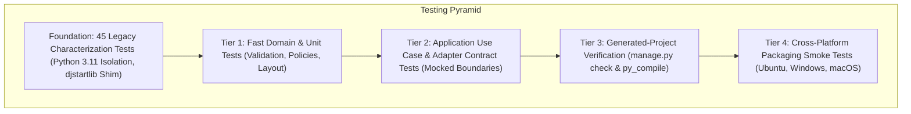
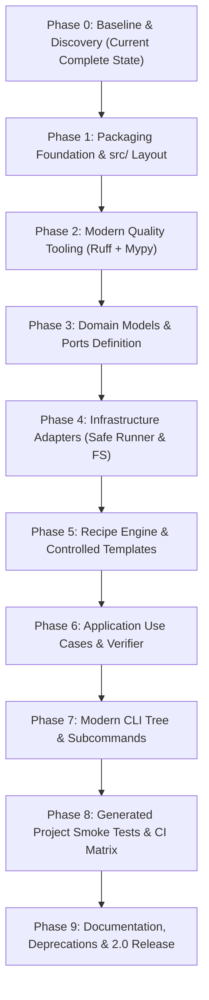

# Django-Start 2.0 Phased Migration Roadmap & Testing Architecture

## 1. Executive Summary

This document defines the ordered implementation roadmap to transition Django-Start from 1.1.6 to 2.0.0.

The roadmap strictly forbids "rewrite everything" approaches. Every phase is an isolated, test-protected milestone that leaves the repository green, with passing quality gates and zero regressions against characterization contracts.

---

## 2. Testing Architecture

The testing strategy follows a rigorous multi-tier pyramid ensuring both backward characterization fidelity and forward contract verification.

### 2.1 Test Layers Detailed

1. **Foundation: Legacy Characterization Suite**:
   - The existing 45 tests in `tests/` remain intact during early phases.
   - **Execution**: Run in an isolated, dedicated virtual environment under Python 3.11 (the verified baseline environment).
   - **Source Scope**: Explicitly restricted to verifying legacy compatibility contracts (`BC-BOOT-01` through `BC-ORCH-01`) and the `djstartlib` compatibility redirect shim in `src/djstartlib/`. Does not gate new 2.0 modules that leverage modern Python 3.12+ features or Django 6.x.
   - **Retirement Criteria**: Eligible for retirement at or after 2.0 GA, subject to explicit gates:
     1. Complete implementation and verification of all 2.0 application use cases and CLI subcommands replacing legacy procedural functions.
     2. Zero remaining production reliance on legacy internal modules (`djstartlib` becomes purely a deprecated shim emitting `DeprecationWarning`).
     3. Comprehensive replacement test suite covering 100% of the contracts originally guarded by characterization tests (Tier 1 unit tests, Tier 2 use cases, and Tier 3/4 smoke tests).
     4. Formal deprecation announcement in release notes and documentation with an explicit sunset timeline for the `djstartlib` package shim.
     Until 2.0 GA, this suite remains a mandatory, blocking CI check against regressions.
2. **Tier 1: Unit & Domain Tests**:
   - Zero filesystem, network, or subprocess I/O.
   - Test `ProjectConfig`, naming validation regexes, recipe schemas, version comparison policies, and CLI argument parsing.
   - Execution time: < 100ms.
3. **Tier 2: Use Case & Adapter Contract Tests**:
   - Test `CreateProjectUseCase` and `AddAppUseCase` using `FakeCommandRunner` and `InMemoryFileSystem`.
   - Verify that use cases construct correct command sequences and handle errors predictably without spawning processes.
4. **Tier 3: Generated Project Verification Tests**:
   - Real subprocess executions in isolated temporary folders (`tmp_path`).
   - Run `django-admin startproject` and apply recipes across supported Django release lines (Django 5.2 LTS and Django 6.1).
   - **Mandatory Verification**: Every generated project configuration must pass `python manage.py check` and compile via `python -m py_compile`.
5. **Tier 4: Packaging & CLI Smoke Tests**:
   - Build wheels via `python -m build`.
   - Install wheels into a fresh, isolated test venv across Ubuntu, Windows, and macOS.
   - Execute `django-start --help`, `django-start doctor`, and `django-start new smoke_test`.

---

## 3. Target CI Architecture

### 3.1 CI Workflow Organization

```mermaid
flowchart LR
    subgraph PR ["Pull Request Pipeline (Blocking)"]
        PR_PKG["Packaging Build & Metadata Verification"]
        PR_LINT["Ruff Lint & Format Check"]
        PR_TYPE["Mypy Type Check (Incremental)"]
        PR_CHAR["Legacy 1.1.6 Tests (Py 3.11 Isolation)"]
        PR_UNIT["2.0 Test Suite (Py 3.12-3.14)"]
        PR_SMOKE["Generated Project Smoke (Linux)"]
    end

    subgraph SCHEDULED ["Scheduled / Release Pipeline"]
        NATIVE_WIN["Windows 11 Runner (Py 3.12-3.14)"]
        NATIVE_MAC["macOS 14+ Runner (Py 3.12-3.14)"]
        CANARY["Python 3.15 RC Canary"]
        CODEQL["CodeQL Analysis v3"]
        PKG_RELEASE["Release Artifact Verification (sdist & wheel)"]
    end

    PR --> SCHEDULED
```

- **PR Gate (Fast, Blocking)**: Runs on Ubuntu with Python 3.12, 3.13, 3.14 for 2.0 suites, and isolated Python 3.11 for characterization. Must finish in under 3 minutes. Includes packaging build verification, Ruff format and lint checks, incremental Mypy static analysis, and generated project verification.
- **Cross-Platform Gate (Release/Main)**: Runs on native Windows 11 and macOS 14+ runners across Python 3.12 through 3.14.
- **Canary Gate**: Weekly scheduled run against Python 3.15 preview.
- **Release Verification Gate**: Validates wheel and sdist installation in clean environments prior to publishing.

---

## 4. Phased Migration Roadmap

### 4.1 Phase Ordering & Dependency Rationale: Why Packaging Precedes Tooling

The implementation roadmap intentionally places **Phase 1: Packaging Foundation & `src/` Layout** before **Phase 2: Modern Quality Tooling (Ruff + Mypy)**:

1. **Canonical Layout Stability**:
   Linters and type checkers require explicit path targets (`src = ["src", "tests"]`, module roots, import resolution boundaries). If tooling were configured in Phase 1 against the legacy flat `djstartlib/` layout and `setup.cfg`, the entire configuration would immediately suffer churn when files relocate to `src/django_start/` in Phase 2. Establishing the `src/` layout first means tooling is configured once against the permanent directory tree.
2. **Eliminating Global State and Import Ambiguity**:
   The 1.1.6 codebase used runtime `sys.path.append(...)` in `djstartlib/models/__init__.py` to enable bare imports (`from models import ...`). Adopting the `src/` layout with `src/django_start/` and the `src/djstartlib/` compatibility redirect establishes clean module discovery. Ruff and Mypy can then analyze idiomatic, fully qualified Python imports without needing synthetic path workarounds.
3. **Single Packaging Authority (PEP 621)**:
   Modern tooling configuration lives in `pyproject.toml` under `[tool.ruff]` and `[tool.mypy]`. Migrating packaging metadata from legacy `setup.py` and `setup.cfg` into `pyproject.toml` in Phase 1 creates the unified configuration host. Phase 2 then cleanly appends tooling tables to `pyproject.toml` without cross-file synchronization debt.
4. **Strict Phase Dependency Sequence**:
   - Phase 0 (Baseline) establishes verified characterization tests.
   - Phase 1 (Packaging Foundation) moves code to `src/`, creates `pyproject.toml` (PEP 621), and builds verified wheels.
   - Phase 2 (Modern Quality Tooling) configures Ruff and Mypy over `src/` and `tests/`, replacing Black, Flake8, and Pyupgrade.
   - Phases 3 through 6 build domain, infrastructure, recipes, and application use cases under strict typing and linting gates.
   - Phase 7 builds the modern Click CLI tree and wires deprecations.
   - Phase 8 verifies generated projects across all OS and framework matrix combinations.
   - Phase 9 finalizes documentation, deprecation guides, and release artifacts.

---

### Phase 1: Packaging Foundation & `src/` Layout

- **Objective**: Adopt standard `src/` layout (`src/django_start/`), configure PEP 621 metadata in `pyproject.toml`, establish `django-start-automate` distribution, create a backward compatibility redirect for `djstartlib` in `src/djstartlib/`, and delete `setup.py` and `setup.cfg`.
- **Components Affected**: Move `djstartlib/` to `src/django_start/`, add `src/djstartlib/` compatibility shim, migrate packaging metadata to `pyproject.toml`, delete `setup.py` and `setup.cfg`.
- **Prerequisites**: Phase 0 baseline complete and green.
- **Dependencies**: Prerequisite for Phase 2; establishes canonical paths and eliminates `sys.path` pollution.
- **Contracts Preserved**: All 31 contracts preserved; `BC-BOOT-01` supported via `src/djstartlib/` shim.
- **Tests Required**: Wheel build succeeds via `python -m build`; entry points execute; 45/45 characterization tests pass under Python 3.11 isolation and Python 3.12+.
- **Rollback Boundary**: Restore `setup.cfg`, `setup.py`, and flat directory layout.
- **Completion Criteria**: `python -m build` generates clean wheel and sdist containing `django_start` and `djstartlib` redirect; zero `sys.path.append` in package source; legacy import paths remain functional with `DeprecationWarning`.

---

### Phase 2: Modern Quality Tooling (Ruff + Mypy)

- **Objective**: Introduce Ruff (linting and formatting) and Mypy (static type checking) into the repository quality pipeline against the established `src/` layout, replacing Black, Flake8, and Pyupgrade.
- **Components Affected**: `pyproject.toml` (`[tool.ruff]`, `[tool.mypy]`), `.pre-commit-config.yaml`, `requirements-dev.txt`.
- **Prerequisites**: Phase 1 complete (`src/` layout and PEP 621 metadata established).
- **Dependencies**: Depends on Phase 1 for canonical layout and centralized `pyproject.toml`. Enforces quality standards for Phase 3 and all subsequent phases.
- **Incremental Typing Strategy**:
  - `src/django_start/`: Strict type checking enforced (`strict = true`, `disallow_untyped_defs = true`, `disallow_any_generics = true`, `check_untyped_defs = true`, `warn_return_any = true`). A `py.typed` marker is bundled in `src/django_start/`.
  - `src/djstartlib/` (Compatibility Shim): Lenient typing configuration (`disallow_untyped_defs = false`). Public entry points and module redirects have explicit boundary signatures, while legacy internal logic is not burdened with exhaustive typing prior to retirement.
  - `tests/`: Targeted typing checks (`check_untyped_defs = true`), ensuring test assertions and helper types are verified without requiring rigid typing overhead on legacy test fixtures.
- **Contracts Preserved**: All 31 contracts (`BC-BOOT-01` through `BC-ORCH-01`); zero behavioral changes.
- **Tests Required**: 45/45 characterization tests passing; `pre-commit run --all-files` green; `ruff check`, `ruff format --check`, and `mypy` execute cleanly.
- **Rollback Boundary**: Revert `pyproject.toml` and `.pre-commit-config.yaml` to Black/Flake8.
- **Completion Criteria**: Pre-commit and CI run Ruff format, Ruff check, and Mypy cleanly; zero style or typing violations; 100% type checking pass rate on new code.

---

### Phase 3: Domain Models & Ports Definition

- **Objective**: Create clean domain types and port protocols in `src/django_start/domain/` and `src/django_start/ports/`.
- **Components Affected**:
  - `src/django_start/domain/config.py` (`ProjectConfig`, `AppConfig`)
  - `src/django_start/domain/errors.py` (Exception hierarchy)
  - `src/django_start/domain/policies.py` (Identifier validation, version policies)
  - `src/django_start/ports/runner.py` (`CommandRunner`, `Command`, `CommandResult`)
  - `src/django_start/ports/filesystem.py` (`FileSystem`)
  - `src/django_start/ports/environment.py` (`EnvironmentManager`)
  - `src/django_start/ports/verifier.py` (`ProjectVerifier`)
- **Prerequisites**: Phase 2 complete.
- **Contracts Preserved**: Legacy code untouched; new modules purely additive.
- **Tests Required**: Unit tests for identifier validation, configuration immutability, and policy evaluation.
- **Rollback Boundary**: Remove additive domain/port files.
- **Completion Criteria**: 100% test coverage and 100% strict mypy typing on new domain modules.

---

### Phase 4: Infrastructure Adapters (Safe Subprocess & Filesystem)

- **Objective**: Implement concrete adapters adhering to port protocols: `SubprocessCommandRunner` (`shell=False`), `LocalFileSystem` (atomic writes, UTF-8), and `VenvEnvironmentManager`.
- **Components Affected**: `src/django_start/infrastructure/`.
- **Prerequisites**: Phase 3 complete.
- **Contracts Preserved**: Eliminates `shell=True` and unencoded file operations in new code.
- **Tests Required**: Adapter contract tests using isolated temporary directories; verification that `SubprocessCommandRunner` rejects shell metacharacters and executes commands safely.
- **Rollback Boundary**: Delete infrastructure adapters.
- **Completion Criteria**: Adapters pass contract test suites across POSIX and Windows path representations.

---

### Phase 5: Recipe Engine & Controlled Templates

- **Objective**: Implement the declarative recipe provider and bundle baseline project templates for Django 5.2 LTS and Django 6.1.
- **Components Affected**: `src/django_start/recipes/`, `src/django_start/infrastructure/builtin_recipes.py`.
- **Prerequisites**: Phase 4 complete.
- **Contracts Preserved**: Replaces fragile string bracket matching (`line_list.index("]\n")`).
- **Tests Required**: Snapshot tests verifying rendered settings, URLs, and templates across `standard`, `minimal`, `api`, and `production` profiles on supported tracks.
- **Rollback Boundary**: Revert recipe directory and template assets.
- **Completion Criteria**: Recipe engine renders valid Python files that compile under `py_compile` without string hacking.

---

### Phase 6: Application Use Cases & Verification

- **Objective**: Implement application orchestration: `CreateProjectUseCase`, `AddAppUseCase`, `DiagnoseEnvironmentUseCase`, and `VerifyProjectUseCase`.
- **Components Affected**: `src/django_start/application/`.
- **Prerequisites**: Phase 5 complete.
- **Contracts Preserved**: Replaces procedural `DjangoStart.setup_project()` and `setup_app()`.
- **Tests Required**: Comprehensive use-case tests using `FakeCommandRunner` and `InMemoryFileSystem`; failure rollback verification.
- **Rollback Boundary**: Revert application use cases.
- **Completion Criteria**: Full orchestration executes in memory with complete mock boundaries, demonstrating staging, verification, and rollback.

---

### Phase 7: Modern CLI Tree & Subcommands

- **Objective**: Build the Click 8.5+ command interface (`django-start new`, `add`, `doctor`, `check`, `recipe`) and eliminate the legacy self-updater (`django-version --update`).
- **Components Affected**: `src/django_start/cli.py`.
- **Prerequisites**: Phase 6 complete.
- **Contracts Preserved**:
  - `BC-CLI-01` supported via backward-compatibility adapter for `django-start <project> <app>`.
  - `django-version` retained as a deprecation shim pointing to `--version`.
  - `BC-VER-05` (shell update) permanently removed.
- **Tests Required**: CLI runner tests verifying arguments, options, error presentation, exit codes, and deprecation notices.
- **Rollback Boundary**: Revert CLI entry points.
- **Completion Criteria**: All subcommands functional with clean user help output and standardized exit codes.

---

### Phase 8: Generated Project Smoke Tests & CI Matrix

- **Objective**: Construct end-to-end integration tests that generate real Django projects and execute `python manage.py check` inside provisioned environments.
- **Components Affected**: `tests/e2e/`, `.github/workflows/ci.yml`.
- **Prerequisites**: Phase 7 complete.
- **Contracts Preserved**: Confirms product invariant 2.5: a successful generation is a verified generation.
- **Tests Required**: Test matrix: Python [3.12, 3.13, 3.14] x Django [5.2 LTS, 6.1] on Ubuntu, macOS, and Windows.
- **Rollback Boundary**: Disable flaky CI combinations if upstream issues arise.
- **Completion Criteria**: All matrix combinations build and pass `manage.py check` cleanly in CI.

---

### Phase 9: Documentation, Deprecations & 2.0 Release

- **Objective**: Update documentation, write migration guides, publish release notes, and tag `2.0.0a1` release.
- **Components Affected**: `README.md`, `docs/`, `CHANGELOG.md`.
- **Prerequisites**: Phase 8 complete.
- **Completion Criteria**: Comprehensive user documentation, green release build, verified PyPI artifact.
