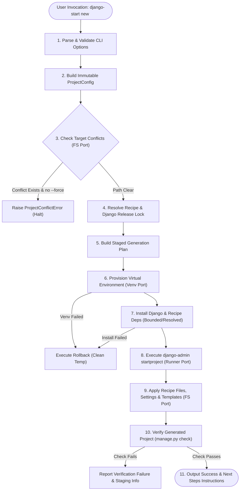
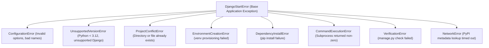

# Django-Start 2.0 Target Product Architecture

## 1. Executive Summary

Django-Start 2.0 evolves from a procedural, shell-dependent script into a deterministic, safe, extensible Django project scaffolding engine and CLI.

The strategic vision is:
> **An opinionated, verifiable Django bootstrap and project-lifecycle CLI that guarantees project reproducibility and strictly protects user data.**

---

## 2. Layered Architectural Blueprint

Dependencies point strictly inward: Presentation and Infrastructure depend on Application and Domain; Domain depends on nothing.

```mermaid
flowchart TD
    subgraph Presentation ["Presentation Layer (src/django_start/cli)"]
        CLI["Click Command Group (cli.py)"]
        NEW_CMD["Command: new"]
        ADD_CMD["Command: add"]
        DOCTOR_CMD["Command: doctor"]
        CHECK_CMD["Command: check"]
        RECIPE_CMD["Command: recipe"]
        VER_CMD["Command: version"]
        PRESENTER["Console Presenter / Rich Renderer"]
    end

    subgraph Application ["Application Layer (src/django_start/application)"]
        UC_NEW["CreateProjectUseCase"]
        UC_ADD["AddAppUseCase"]
        UC_DOC["DiagnoseEnvironmentUseCase"]
        UC_CHK["VerifyProjectUseCase"]
        UC_REC["ListRecipesUseCase"]
    end

    subgraph Domain ["Domain Layer (src/django_start/domain)"]
        CONFIG["ProjectConfig (dataclass)"]
        APP_CONF["AppConfig (dataclass)"]
        RECIPE_MOD["Recipe / RecipeMetadata"]
        LAYOUT["ProjectLayout (path values)"]
        POLICY["VersionPolicy / SupportRules"]
        ERRORS["DjangoStartError Hierarchy"]
    end

    subgraph Ports ["Ports / Interfaces (src/django_start/ports)"]
        RUNNER_PORT["CommandRunner (Protocol)"]
        FS_PORT["FileSystem (Protocol)"]
        VENV_PORT["EnvironmentManager (Protocol)"]
        INSTALLER_PORT["PackageInstaller (Protocol)"]
        SCAFFOLD_PORT["ScaffoldEngine (Protocol)"]
        VERIFY_PORT["ProjectVerifier (Protocol)"]
        RECIPE_PORT["RecipeProvider (Protocol)"]
    end

    subgraph Infrastructure ["Infrastructure Adapters (src/django_start/infrastructure)"]
        SUBPROCESS_RUNNER["SubprocessCommandRunner"]
        LOCAL_FS["LocalFileSystem (atomic writes, utf-8)"]
        STD_VENV["VenvEnvironmentManager (stdlib venv)"]
        PIP_INSTALLER["PipInstaller (pip install)"]
        DJANGO_SCAFFOLD["DjangoScaffoldEngine (startproject/startapp)"]
        MANAGE_VERIFIER["ManagePyVerifier (manage.py check)"]
        BUILTIN_RECIPES["BuiltinRecipeProvider"]
    end

    CLI --> NEW_CMD & ADD_CMD & DOCTOR_CMD & CHECK_CMD & RECIPE_CMD & VER_CMD
    NEW_CMD --> UC_NEW
    ADD_CMD --> UC_ADD
    DOCTOR_CMD --> UC_DOC
    CHECK_CMD --> UC_CHK
    RECIPE_CMD --> UC_REC

    UC_NEW --> CONFIG & RECIPE_MOD & LAYOUT & ERRORS & POLICY
    UC_NEW --> RUNNER_PORT & FS_PORT & VENV_PORT & INSTALLER_PORT & SCAFFOLD_PORT & VERIFY_PORT & RECIPE_PORT

    SUBPROCESS_RUNNER -. implements .-> RUNNER_PORT
    LOCAL_FS -. implements .-> FS_PORT
    STD_VENV -. implements .-> VENV_PORT
    PIP_INSTALLER -. implements .-> INSTALLER_PORT
    DJANGO_SCAFFOLD -. implements .-> SCAFFOLD_PORT
    MANAGE_VERIFIER -. implements .-> VERIFY_PORT
    BUILTIN_RECIPES -. implements .-> RECIPE_PORT
```



### 2.1 Domain Layer: Strengthened `VersionPolicy` Specification

The `VersionPolicy` domain component is the single source of truth for runtime framework rules, version track resolution, and platform compatibility constraints:

1. **Framework Track Resolution**:
   - Maps symbolic tracks (`latest`, `lts`) to concrete Django release lines and corresponding compatibility bounds:
     - `latest` resolves to the newest tested stable feature line (e.g. `Django 6.1.1`).
     - `lts` resolves to the active supported LTS release (e.g. `Django 5.2.17`).
     - Explicit version specifiers (e.g. `6.1`, `5.2`, `6.1.1`, `5.2.17`) are validated against the supported matrix and resolved to bounded constraints and designated lockfile targets.
2. **DEP 20 & CalVer Transition Governance**:
   - Encapsulates Django DEP 20's transition from the historical 8-month feature cycle to annual CalVer (`YYYY.N`) starting with Django 2028.0 (January 2028).
   - Treats the `lts` track keyword as a **transitional compatibility alias**. Following Django 6.2 LTS (April 2027), all releases receive uniform 3-year support, retiring the designated LTS model. `VersionPolicy` will emit informational deprecation guidance when `lts` is requested for post-6.2 targets.
3. **Host Python x Django Matrix Enforcement**:
   - Pre-validates host interpreter compatibility against target Django versions before scaffolding begins:
     - Rejects host Python < 3.12 with typed `UnsupportedVersionError`.
     - Validates that Python 3.12, 3.13, or 3.14 matches the requested Django release.
4. **Reproducibility Strategy**:
   - Rejects unpinned or floating versions (`django>=0`, unbounded `pip install django`) in project generation.
   - Enforces that generated dependency manifests declare bounded compatible constraints (e.g. `Django>=6.1.1,<6.2`).
   - Exact tested pins are enforced at the lockfile layer (pending evaluation).

### 2.2 Port & Infrastructure Adapter Mapping

- **`EnvironmentManager` (Port)**: Defines environment lifecycle operations (`create`, `exists`).
  - **`VenvEnvironmentManager` (Adapter)**: Standard library implementation using Python's built-in `venv` module. Zero extra dependencies required.
- **`PackageInstaller` (Port)**: Defines package installation contracts (`install`).
  - **`PipInstaller` (Adapter)**: Standard implementation using `python -m pip install` executed via `CommandRunner` using argument vectors.
- **Adapter Evaluation Guardrail**:
  - Alternative adapters (such as `UvInstaller` or unified `UvEnvironmentManager`) remain under active research evaluation.
  - The architecture does NOT pre-select `UvInstaller` for the core distribution until the comparative evaluation benchmarks and fallback mechanisms are finalized.

---

## 3. The Generation Lifecycle

The generation lifecycle enforces validation, planning, execution, verification, and rollback boundaries.



---

## 4. Subprocess Execution & CommandRunner Boundary

### 4.1 Requirements & Safety Invariants
- `shell=True` is strictly forbidden.
- Commands must be constructed as explicit argument sequences (`list[str]`).
- Commands must be executed with explicit working directory (`cwd: Path`).
- Environment variables must be explicitly controlled rather than relying on host process pollution.
- Standard output and standard error must be captured cleanly into structured value types.
- Library code never calls `sys.exit()`. Failures raise `CommandExecutionError`.

### 4.2 Port Definition
```python
from dataclasses import dataclass
from pathlib import Path
from typing import Mapping, Protocol, Sequence


@dataclass(frozen=True)
class Command:
    argv: Sequence[str]
    cwd: Path
    env: Mapping[str, str] | None = None
    timeout: float | None = 120.0


@dataclass(frozen=True)
class CommandResult:
    returncode: int
    stdout: str
    stderr: str

    @property
    def succeeded(self) -> bool:
        return self.returncode == 0


class CommandRunner(Protocol):
    def run(self, command: Command) -> CommandResult:
        """Execute command synchronously and return structured result."""
        ...
```

### 4.3 Safe Command Invocations for Django-Start 2.0

| Operation | 1.1.6 Legacy Command | 2.0 Safe Invocation (`Command.argv`) |
|---|---|---|
| **Create Venv** | `sys.executable -m venv <path>` (via shell) | `[sys.executable, "-m", "venv", str(venv_dir)]` |
| **Install Django** | `python -m pip install django` (unpinned, shell) | `[str(python_bin), "-m", "pip", "install", f"Django=={pinned_version}"]` |
| **Upgrade Pip** | `python -m pip install --upgrade pip` (silent, shell) | Removed. Only run if user explicitly passes `--upgrade-pip`. |
| **Start Project** | `django-admin startproject <name> .` (via shell) | `[str(django_admin_bin), "startproject", project_name, str(target_dir)]` |
| **Start App** | `python manage.py startapp <app>` (via shell) | `[str(python_bin), "manage.py", "startapp", app_name]` (in project root) |
| **Check Project** | None (unverified) | `[str(python_bin), "manage.py", "check"]` (in project root) |
| **Compile Python** | None (unverified) | `[str(python_bin), "-m", "py_compile", str(file_path)]` |

### 4.4 Port Definitions: EnvironmentManager & PackageInstaller

To isolate application use cases from concrete virtual environment mechanics and package management tools, two dedicated ports are defined:

```python
from dataclasses import dataclass
from pathlib import Path
from typing import Protocol, Sequence


@dataclass(frozen=True)
class EnvironmentDetails:
    root_path: Path
    python_executable: Path
    scripts_path: Path


class EnvironmentManager(Protocol):
    def create(self, target_dir: Path) -> EnvironmentDetails:
        """Create an isolated virtual environment at the target directory."""
        ...

    def exists(self, target_dir: Path) -> bool:
        """Check if an environment exists at the target directory."""
        ...


@dataclass(frozen=True)
class InstallResult:
    succeeded: bool
    installed_packages: Sequence[str]
    error_message: str | None = None


class PackageInstaller(Protocol):
    def install(
        self,
        env: EnvironmentDetails,
        requirements: Sequence[str],
        timeout: float | None = 180.0,
    ) -> InstallResult:
        """Install package specifications into the designated environment."""
        ...
```

#### Infrastructure Adapters & Evaluation Policy
1. **`VenvEnvironmentManager` (Baseline Adapter)**:
   - Standard library implementation using Python's built-in `venv` module.
   - Requires zero third-party dependencies.
2. **`PipInstaller` (Baseline Adapter)**:
   - Standard implementation using `python -m pip install` executed via `CommandRunner` with explicit argument sequences.
   - Strictly enforces argument vector execution without `shell=True`.
3. **Pluggable Architecture & Evaluation Status**:
   - The architecture deliberately decouples these ports so alternative adapters (such as `UvInstaller` or a combined `UvEnvironmentManager`) can be introduced without modifying application use cases.
   - Crucially, `UvInstaller` is NOT pre-selected for core until empirical benchmarking across Linux, macOS, and Windows confirms performance, cross-platform parity, and fallback reliability.

---

## 5. Filesystem Safety & Controlled I/O Boundary

### 5.1 Invariant: Never Silently Destroy User Data
Django-Start 2.0 treats all existing files, settings, and directories as sacred user data.
1. If the project directory already exists and contains files, scaffolding aborts with `ProjectConflictError` before creating virtualenvs or running commands.
2. An existing file is never overwritten unless the user explicitly passes `--force` (and even then, a `.bak` copy is preserved).

### 5.2 Encoding & Atomic Writes
1. **Explicit UTF-8**: All text read and write operations explicitly specify `encoding="utf-8"`.
2. **Atomic Writes**: When updating configuration files (e.g. `settings.py`), the file is written to a sibling temporary file (`settings.py.tmp.XXXXXX`) and renamed atomically (`os.replace`). This guarantees that a crash or interruption never leaves a truncated file.
3. **Rollback Mechanism**: If scaffolding fails midway (e.g. package installation fails or network disconnects), the `CreateProjectUseCase` executes registered cleanup compensations, safely removing the temporary staging folder and virtualenv, or printing exact instructions if manual intervention is required.

---

## 6. Django Source & Configuration Generation Strategy

### 6.1 Replacement of Fragile Whitespace Mutation

In 1.1.6, source modification relied on:
- `line_list.index("]\n")` (crashes if formatted with spaces or trailing comments).
- Replacing `# Create your views here.\n` (crashes or warns falsely if comment was removed).

### 6.2 Evaluated Generation Alternatives

| Strategy | Mechanism | Pros | Cons | Verdict |
|---|---|---|---|---|
| **Controlled Django Project Templates** | Pass `--template` to `django-admin startproject`. | Native Django feature; zero source parsing needed; clean project structure. | Requires maintaining separate template trees for each Django version line. | **ACCEPTED for Base Scaffolding** |
| **Recipe-Driven File Generation** | Scaffold clean baseline, then lay down complete recipe files. | Deterministic; byte-exact; format-independent. | Must ensure recipe templates stay synchronized with Django defaults. | **ACCEPTED for Extended Features** |
| **AST Transformation (`libcst` or `ast`)** | Parse Python AST, locate `INSTALLED_APPS` and `urlpatterns`, insert nodes, serialize. | Robust against whitespace variations; safe against ordering. | Heavy runtime dependency (`libcst`); complex comment preservation in stdlib `ast`. | **Selective / Deferred**: Use stdlib AST only for validation, not mutation. |
| **String / Line Matching (1.1.6)** | Match `"]\n"` verbatim. | Simple to write. | Extremely fragile; breaks under formatters. | **REJECTED** |

### 6.3 2.0 Architectural Decision
Django-Start 2.0 combines **Controlled Django Templates** for initial layout with **Declarative Recipe Rendering**:
- Django-Start owns the baseline template package for each supported Django line (`5.2` and `6.1`).
- Rather than running `startproject` and then mutating its output with string hacks, Django-Start passes its own validated template directory or generates files directly from declarative recipe templates.
- This produces clean, pre-configured `settings.py` and `urls.py` with zero string-bracket hacks.

---

## 7. Recipe & Profile Engine

### 7.1 Separation of Profiles and Framework Tracks
Django-Start 2.0 strictly decouples architectural project profiles from framework release tracks:

1. **Profiles (Architectural Archetypes)**:
   Define the structural blueprints, starter applications, template layouts, configuration files, and default third-party packages:
   - **`standard` (Default)**: Full-featured traditional Django starter with a dedicated core app, base HTML templates, static assets, SQLite, and health-check endpoint.
   - **`minimal`**: Ultra-lean layout without demo HTML views or extra apps, ideal for microservices, command-line workers, or barebones prototyping.
   - **`api`**: Modern RESTful starter pre-configured with Django REST Framework, API router wiring, serializer examples, and health endpoint.
   - **`production`**: Production-ready archetype featuring split settings (`base.py`, `local.py`, `production.py`), Dockerfile, `docker-compose.yml`, WSGI/ASGI production configurations, and security middleware defaults.

2. **Framework Tracks (`--django`)**:
   Define the framework release line and exact patch version injected into the project:
   - **`latest` (Default)**: Resolves to the newest tested stable feature release (currently Django 6.1.1).
   - **`lts` (Transitional)**: Resolves to the active supported LTS release (currently Django 5.2.17). Maintained as a transitional alias preparing for DEP 20's uniform 3-year support model.
   - **Explicit Version (`<version>`)**: Exact release line or patch release (e.g. `6.1`, `5.2`, `6.1.1`, `5.2.17`).

Every profile is orthogonal to and compatible with every supported framework track.

### 7.2 Recipe Schema & Metadata
Recipes are defined declaratively with explicit schema versioning, recipe versioning, and formal dependency/Python specifiers:

```python
from dataclasses import dataclass
from typing import Sequence


@dataclass(frozen=True)
class RecipeMetadata:
    schema_version: str  # Metadata specification version (e.g. "1.0")
    recipe_version: str  # Semantic version of the recipe (e.g. "2.0.0")
    name: str  # Profile identifier (e.g. "standard", "api", "minimal", "production")
    display_name: str  # Human-readable title
    description: str  # Comprehensive description of project archetype
    python_requires: str  # Formal Python version specifier (e.g. ">=3.12")
    django_requires: str  # Formal Django version specifier (e.g. ">=5.2")
    supported_tracks: Sequence[str]  # e.g. ("latest", "lts")
    dependencies: Sequence[
        str
    ]  # Formal package specifiers (e.g. ["djangorestframework>=3.15,<4"])
    template_dir: str  # Relative POSIX path to template files
    post_generate_hooks: Sequence[
        str
    ] = ()  # Safe internal hooks executed post-scaffolding
```

---

## 8. Lifecycle Commands Specification

Django-Start 2.0 introduces a structured CLI command tree:

```text
django-start
├── new <project_name>     # Scaffold a new Django project
├── add <app_name>         # Add an application to an existing Django-Start project
├── doctor                 # Inspect host environment, Python, and Django readiness
├── check                  # Verify validity of an existing project (manage.py check)
├── recipe                 # Inspect and list available recipes
└── --version              # Output tool version and runtime details
```

### 8.1 Detailed Command Specifications

#### `django-start new <project_name>`
- **Inputs**:
  - `project_name` (required argument): Valid Python identifier for the project directory and package.
  - `--app <app_name>` (default: `core`): Name of the initial Django application created inside the project.
  - `--profile <standard|minimal|api|production>` (default: `standard`): Architectural archetype defining project layout and templates.
  - `--django <latest|lts|version>` (default: `latest`): Framework track or explicit version. `latest` resolves to current stable feature line (Django 6.1.1); `lts` resolves to active LTS (Django 5.2.17, transitional alias per DEP 20); or explicit version string (e.g. `6.1.1`, `5.2.17`).
  - `--venv-path <path>` (default: `.venv`): Custom location for virtual environment.
  - `--no-venv`: Flag to skip environment provisioning and use the executing interpreter.
  - `--dry-run`: Preview planned actions and generated file tree without mutating the filesystem.
  - `--force`: Override conflict detection (backs up existing colliding files to `.bak`).
- **Execution**: Validates inputs via `VersionPolicy`, creates virtual environment (`EnvironmentManager`), installs resolved dependencies (`PackageInstaller`), scaffolds base project (`ScaffoldEngine`), renders recipe templates (`FileSystem`), runs `manage.py check` verification (`ProjectVerifier`), reports success.
- **Rollback**: Safely cleans temporary staging resources if any step fails.

#### `django-start add <app_name>`
- **Inputs**: `app_name` (required argument), `--project-dir <path>` (default: current directory).
- **Execution**: Verifies that current directory is a valid Django project, invokes `manage.py startapp`, wires the app into `INSTALLED_APPS` and root `urls.py` safely, creates starter view and templates.
- **Safety**: Aborts if `<app_name>` already exists in directory or in `INSTALLED_APPS`.

#### `django-start doctor`
- **Inputs**: None.
- **Output**: Diagnostic checklist inspecting:
  - Host Python version (checks for >= 3.12).
  - Virtual environment state.
  - Presence of build tools (`pip`, `setuptools`).
  - Active Django version (if inside a project).
  - Terminal encoding (ensures UTF-8 support).
  - Optional update check against PyPI (timeout: 2.0s, non-blocking).

#### `django-start check`
- **Inputs**: `--project-dir <path>`.
- **Execution**: Runs `python manage.py check` inside the project's virtualenv and reports configuration health with human-readable formatting.

---

## 9. Application Error Model

Django-Start 2.0 defines an explicit exception hierarchy. Library code never calls `sys.exit()`. The CLI layer traps domain exceptions and formats user-friendly error messages with remediation advice.



### Exit Code Mapping

| Exception | Exit Code | Presentation |
|---|---|---|
| **Success** | `0` | Green status message with next-step commands. |
| **`ConfigurationError`** | `2` | Red error description + Click command usage. |
| **`ProjectConflictError`** | `3` | Warning details + actionable recommendation (use another name or folder). |
| **`UnsupportedVersionError`** | `4` | Clear explanation of required Python/Django version floors. |
| **`EnvironmentCreationError` / `DependencyInstallError`** | `5` | Subprocess failure details + pip troubleshooting guide. |
| **`VerificationError`** | `6` | Exact Django check traceback + configuration fix advice. |
| **`NetworkError`** | `7` | Warning message; graceful degradation to offline mode. |
| **Unexpected Exception** | `1` | Clean fatal traceback + link to GitHub issue tracker. |

---

## 10. Cross-Platform Abstraction

### 10.1 Virtual Environment Layout
- **POSIX (Linux / macOS)**:
  - Python binary: `<venv>/bin/python`
  - Django admin: `<venv>/bin/django-admin`
  - Scripts folder: `<venv>/bin`
- **Windows**:
  - Python binary: `<venv>/Scripts/python.exe`
  - Django admin: `<venv>/Scripts/django-admin.exe`
  - Scripts folder: `<venv>/Scripts`
- **Abstraction**: Handled centrally in `EnvironmentManager` port; application use cases never check `platform.system()` directly.

### 10.2 Path Separators
- All template names and project-relative identifiers use portable forward slashes (`/`).
- Filesystem paths are constructed strictly via `pathlib.Path` (`path / "subdir" / "file.py"`), eliminating hardcoded `os.sep` or string concatenation.
